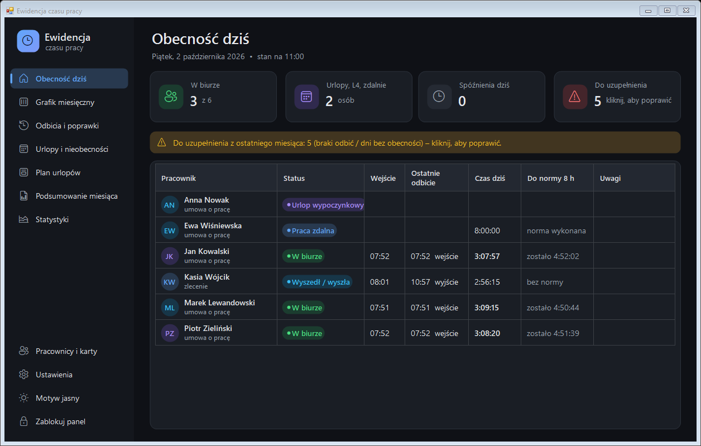
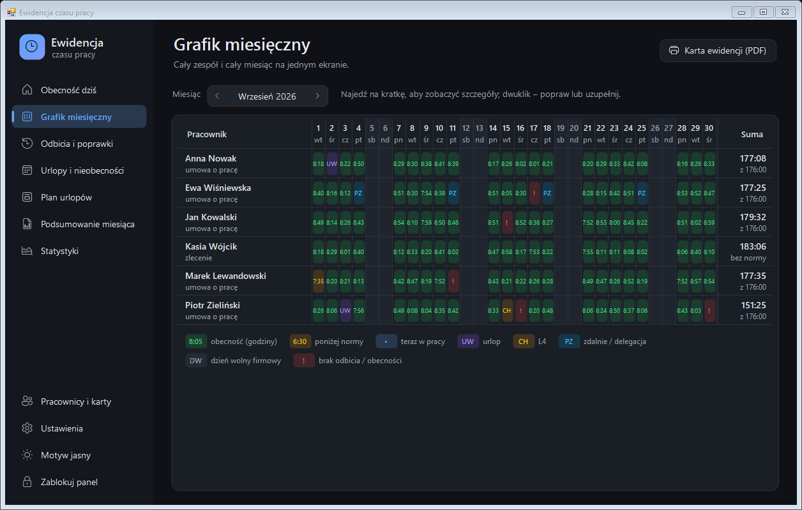
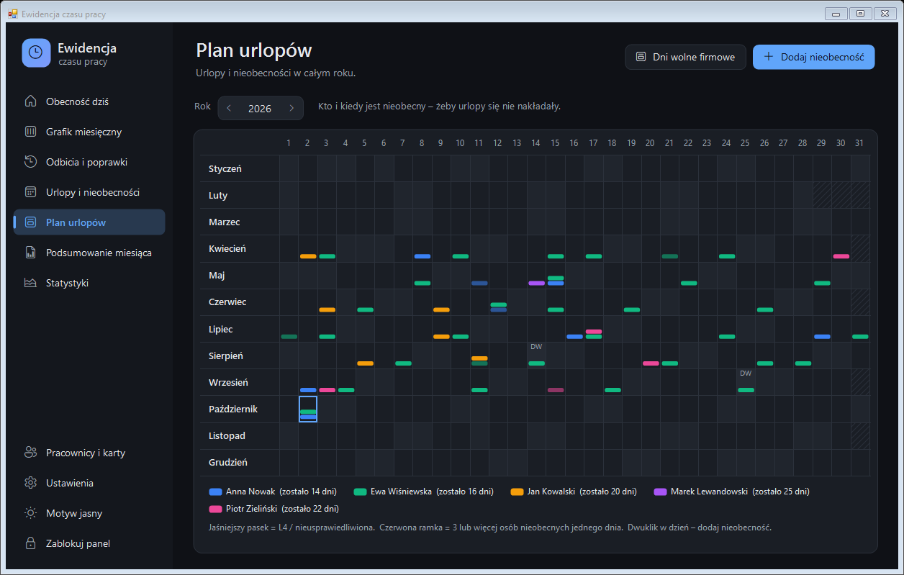
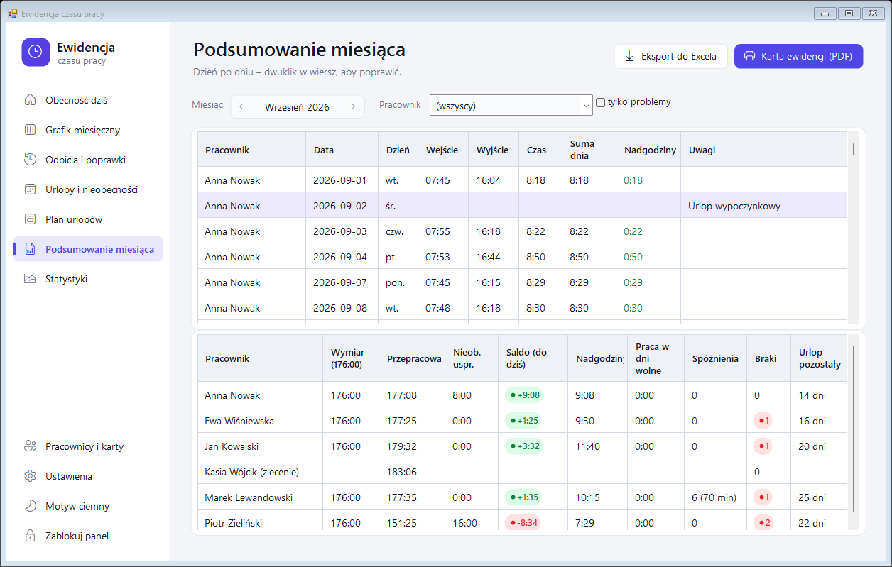
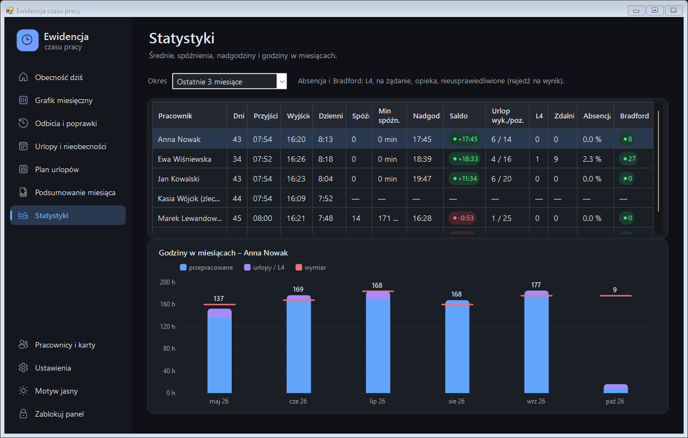
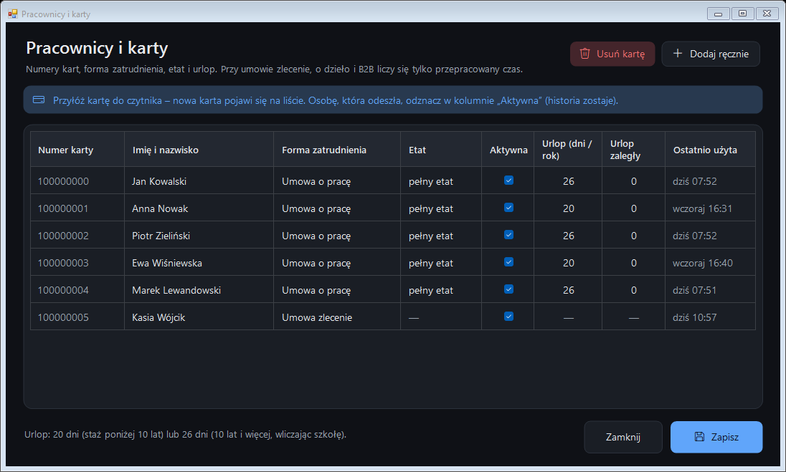
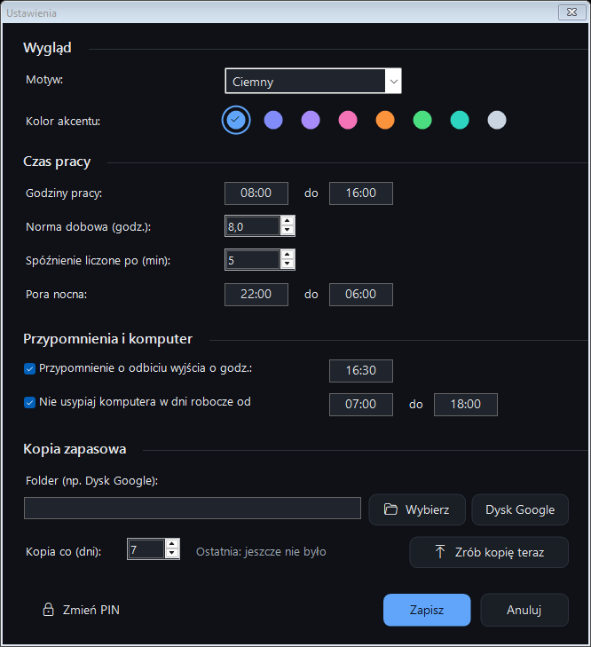
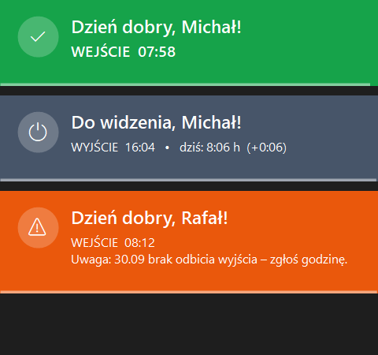
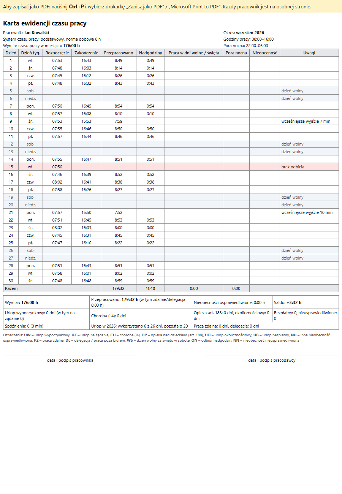

<div align="center">

# đź•’ Ewidencja Czasu Pracy

**Rejestracja czasu pracy kartami RFID/NFC dla małego biura – prosto, lokalnie, zgodnie z Kodeksem pracy.**




</div>

---

## Spis treści

- [Co to jest](#co-to-jest)
- [NajwaĹĽniejsze funkcje](#najwaĹĽniejsze-funkcje)
- [Zrzuty ekranu](#zrzuty-ekranu)
- [Wymagania](#wymagania)
- [Szybki start](#szybki-start)
- [Jak działa czytnik](#jak-działa-czytnik)
- [Dane i prywatność](#dane-i-prywatność)
- [Struktura projektu](#struktura-projektu)
- [Kompilacja i testy](#kompilacja-i-testy)
- [Dokumentacja](#dokumentacja)

---

## Co to jest

**Ewidencja Czasu Pracy** to program dla Windows, który zamienia zwykły czytnik kart RFID/NFC na USB
w system rejestracji czasu pracy (RCP). Pracownik przykłada kartę przy wejściu i wyjściu, a program:

- rejestruje godziny i pokazuje duĹĽe, czytelne powitanie lub poĹĽegnanie,
- liczy czas pracy, normy, nadgodziny i saldo,
- prowadzi urlopy, L4 i inne nieobecności,
- przygotowuje **kartÄ™ ewidencji czasu pracy** (art. 149 KP) i raport do Excela.

Program działa w tle na zwykłym komputerze biurowym, **bez serwera, abonamentu i internetu**.
Wszystkie dane zostajÄ… na dysku firmy.

## NajwaĹĽniejsze funkcje

| | Funkcja | Opis |
|---|---|---|
| 💳 | **Odbicia kartą** | Czytnik USB w trybie klawiatury. Numer karty nie trafia do okna, w którym pracujesz – program rozpoznaje czytnik po „maszynowym” tempie pisania. |
| 👋 | **Powitanie / pożegnanie** | Duży, kolorowy komunikat: zielony przy wejściu, grafitowy przy wyjściu, z czasem pracy z danego dnia. |
| 📊 | **Obecność na żywo** | Kto jest w biurze, od kiedy, ile już przepracował (licznik z sekundami) i ile zostało do normy. |
| 🗓️ | **Grafik miesięczny** | Cały zespół i cały miesiąc na jednym ekranie: obecności, urlopy, L4, braki odbić. |
| 🏖️ | **Urlopy i nieobecności** | Urlop wypoczynkowy i na żądanie, L4, opieka, praca zdalna, delegacja i inne. Licznik pozostałego urlopu. |
| 📅 | **Roczny plan urlopów** | Kto i kiedy jest nieobecny w całym roku – ostrzega, gdy nieobecnych jest 3 lub więcej osób naraz. |
| 🏢 | **Dni wolne firmowe** | Jeden dzień wolny dla wszystkich (np. za święto w sobotę, firmowa Wigilia). |
| ⚖️ | **Normy i nadgodziny** | Wymiar czasu pracy z polskim kalendarzem świąt, nadgodziny, praca w dni wolne, pora nocna, spóźnienia. |
| 📝 | **Formy zatrudnienia** | Umowa o pracę (również część etatu), umowa zlecenie, o dzieło, B2B. Przy umowach cywilnych liczy się tylko przepracowany czas. |
| 🖨️ | **Karta ewidencji (PDF)** | Gotowa do podpisu karta ewidencji czasu pracy, a dla zleceniobiorców – ewidencja godzin wykonywania zlecenia. |
| 📈 | **Statystyki** | Średnie godziny, spóźnienia, saldo, wskaźnik absencji i **współczynnik Bradforda**, wykres godzin. |
| 🔔 | **Przypomnienia** | O odbiciu wyjścia o wybranej godzinie, o brakującym wyjściu z poprzedniego dnia. |
| ✏️ | **Poprawki z historią** | Ręczne dodawanie i poprawianie odbić; każda zmiana trafia do historii (kto, kiedy, co było, co jest). |
| 🔐 | **PIN administratora** | Panel, zmiany i zamknięcie programu chronione PIN-em. Panel blokuje się sam po 10 minutach. |
| đź’ľ | **Kopie zapasowe** | Codzienna kopia lokalna i cotygodniowa kopia `.zip` np. na Dysk Google. |
| 🛡️ | **Odporność** | Autostart z Windows, wykrywanie przerw w działaniu, automatyczny restart po błędzie, komputer nie usypia w godzinach pracy. |
| 🎨 | **Wygląd** | Motyw jasny, ciemny lub zgodny z Windows i 8 kolorów akcentu. |

## Zrzuty ekranu

> Na zrzutach są wyłącznie **przykładowe, zmyślone dane**.

<table>
<tr>
<td width="50%"><b>Grafik miesięczny</b><br></td>
<td width="50%"><b>Roczny plan urlopĂłw</b><br></td>
</tr>
<tr>
<td><b>Podsumowanie miesiÄ…ca (motyw jasny)</b><br></td>
<td><b>Statystyki i współczynnik Bradforda</b><br></td>
</tr>
<tr>
<td><b>Pracownicy i karty</b><br></td>
<td><b>Ustawienia</b><br></td>
</tr>
<tr>
<td><b>Powiadomienia przy odbiciu</b><br></td>
<td><b>Karta ewidencji czasu pracy</b><br></td>
</tr>
</table>

## Wymagania

- **Windows 10 lub 11** (wbudowany .NET Framework 4.x – nic nie trzeba instalować).
- **Czytnik RFID/NFC na USB działający jak klawiatura** – po przyłożeniu karty wpisuje numer i naciska Enter
  (łatwo sprawdzić w Notatniku). Program domyślnie oczekuje co najmniej 8 cyfr.
- Karty pasujące do czytnika (np. 125 kHz EM4100 lub 13,56 MHz MIFARE – zależnie od czytnika).

## Szybki start

1. **Zbuduj program** – uruchom [`zrodla/kompiluj.bat`](zrodla/kompiluj.bat).
   Kompilator jest częścią Windows, powstanie plik `EwidencjaCzasu.exe`.
2. **Uruchom `EwidencjaCzasu.exe`** – przy zegarku pojawi się ikonka, program działa w tle
   i sam doda siÄ™ do autostartu.
3. **Ustaw PIN** – przy pierwszym otwarciu panelu (dwuklik na ikonce) program poprosi o PIN administratora.
4. **Dodaj karty** – przyłóż nową kartę do czytnika, podaj PIN i wpisz imię i nazwisko.
   Albo otwórz *Pracownicy i karty* i przykładaj karty po kolei.
5. **Ustaw formÄ™ zatrudnienia i urlop** w oknie *Pracownicy i karty*.
6. **Ustaw kopiÄ™ zapasowÄ…** w *Ustawieniach* (np. folder na Dysku Google).

Gotowe – od teraz każde przyłożenie karty to wejście lub wyjście.

Szczegółowy opis wszystkich ekranów: **[Instrukcja obsługi](docs/INSTRUKCJA.md)**.

## Jak działa czytnik

Tani czytnik USB „udaje” klawiaturę: wpisuje numer karty i Enter tam, gdzie akurat jest kursor.
Program instaluje w Windows globalny hak klawiatury i **rozpoznaje czytnik po tempie pisania** –
czytnik wpisuje cały numer w kilkadziesiąt milisekund (poniżej 50 ms na znak), człowiek pisze dużo wolniej.

- Cyfry wpisane przez czytnik są przechwytywane – nie trafiają do Worda, Excela ani przeglądarki.
- Cyfry wpisane przez człowieka są natychmiast odtwarzane w oryginalnej kolejności (opóźnienie ok. 0,05 s – niezauważalne).
- Próg tempa i minimalną liczbę cyfr można zmienić w `ustawienia.txt`.

Więcej: [Dokumentacja techniczna](docs/TECHNICZNE.md#rozpoznawanie-czytnika).

## Dane i prywatność

- Dane sÄ… zapisywane lokalnie w folderze **`Dokumenty\EwidencjaCzasu`** w prostych plikach CSV
  (można je otworzyć w Excelu).
- Program **niczego nie wysyła do internetu**. Jedyne kopiowanie poza komputer to kopia zapasowa
  do folderu, ktĂłry sam wskaĹĽesz (np. Dysk Google).
- Karty zbliżeniowe to nie biometria – wystarczy poinformować pracowników o systemie
  (cel, zakres danych, okres przechowywania) i dopisać go do regulaminu pracy.
- Repozytorium zawiera **wyłącznie kod i dokumentację** – plik `.gitignore` wyklucza dane, kopie zapasowe i pliki programu.

## Struktura projektu

```
EwidencjaCzasu/
├── zrodla/                 kod źródłowy (C#, Windows Forms)
│   ├── Dane.cs             start programu, ustawienia, pliki danych, kalendarz świąt,
│   │                       wyliczenia (normy, nadgodziny, absencja), raporty, kopie, PIN
│   ├── Czytnik.cs          przechwytywanie czytnika (globalny hak klawiatury)
│   ├── Aplikacja.cs        ikonka przy zegarku, obsługa odbić, przypomnienia, okna dialogowe
│   ├── Panel.cs            panel zarządzania (strony, tabele, wykres)
│   ├── Grafik.cs           grafik miesięczny, roczny plan urlopów, dni wolne firmowe
│   ├── Wyglad.cs           motywy, kolory, przyciski, karty, pola dat, nawigacja
│   └── kompiluj.bat        kompilacja do EwidencjaCzasu.exe
├── testy/
│   ├── Testy.cs            testy logiki (czytnik, kalendarz, normy, raporty, kopie…)
│   └── uruchom_testy.bat
└── docs/
    ├── INSTRUKCJA.md       instrukcja obsługi
    ├── TECHNICZNE.md       dokumentacja techniczna
    └── img/                zrzuty ekranu
```

## Kompilacja i testy

Nie potrzeba Visual Studio – wystarczy kompilator C# wbudowany w Windows (`csc.exe` z .NET Framework 4).

```bat
zrodla\kompiluj.bat        :: buduje EwidencjaCzasu.exe w folderze głównym
testy\uruchom_testy.bat    :: kompiluje i uruchamia testy
```

Przed kompilacją zamknij działający program (prawy klik na ikonce → *Zamknij program*).

## Dokumentacja

- 📘 **[Instrukcja obsługi](docs/INSTRUKCJA.md)** – codzienna praca, wszystkie ekrany, najczęstsze pytania.
- 🔧 **[Dokumentacja techniczna](docs/TECHNICZNE.md)** – architektura, pliki danych, ustawienia, algorytmy, rozwój.

---

<div align="center">
<sub>Kenochem · Ewidencja Czasu Pracy</sub>
</div>

