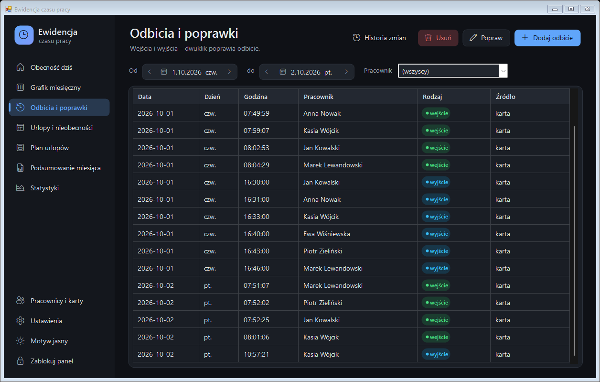
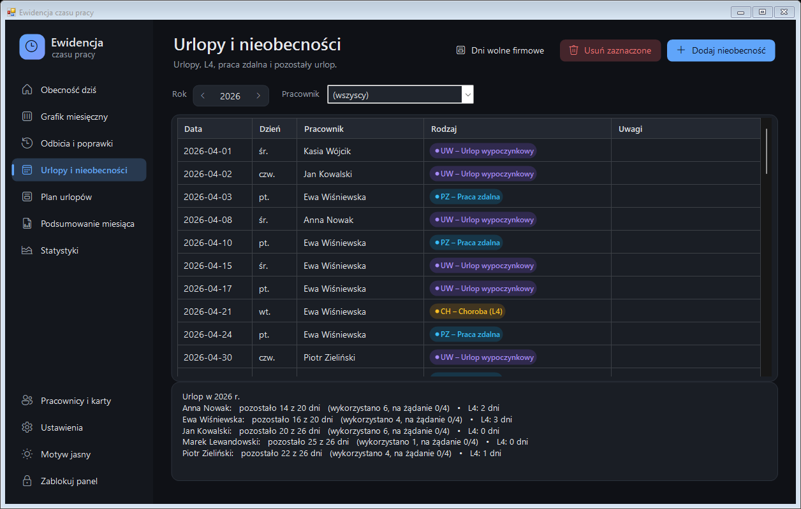
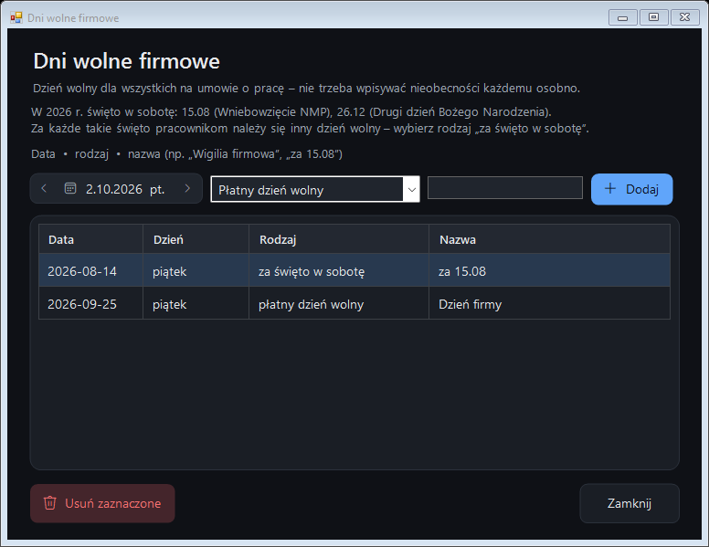

# 📘 Instrukcja obsługi

[← Powrót do README](../README.md)

- [Codzienna praca](#codzienna-praca)
- [Ikonka przy zegarku](#ikonka-przy-zegarku)
- [Panel zarządzania](#panel-zarządzania)
  - [Obecność dziś](#obecność-dziś)
  - [Grafik miesięczny](#grafik-miesięczny)
  - [Odbicia i poprawki](#odbicia-i-poprawki)
  - [Urlopy i nieobecności](#urlopy-i-nieobecności)
  - [Plan urlopów](#plan-urlopów)
  - [Podsumowanie miesiąca](#podsumowanie-miesiąca)
  - [Statystyki](#statystyki)
- [Pracownicy i karty](#pracownicy-i-karty)
- [Formy zatrudnienia](#formy-zatrudnienia)
- [Dni wolne firmowe](#dni-wolne-firmowe)
- [Ustawienia](#ustawienia)
- [Karta ewidencji i raport do Excela](#karta-ewidencji-i-raport-do-excela)
- [Kopie zapasowe](#kopie-zapasowe)
- [Bezpieczeństwo i PIN](#bezpieczeństwo-i-pin)
- [Najczęstsze pytania](#najczęstsze-pytania)

---

## Codzienna praca

Dla pracowników obsługa ogranicza się do **przyłożenia karty**:

| Sytuacja | Co się dzieje |
|---|---|
| Pierwsze przyłożenie w danym dniu | **WEJŚCIE** – zielony komunikat „Dzień dobry, …!” |
| Kolejne przyłożenie | **WYJŚCIE** – grafitowy komunikat „Do widzenia, …!” z czasem pracy z dziś |
| Wyjście w ciągu dnia i powrót | kolejne przyłożenia to na zmianę wejście i wyjście, czas się sumuje |
| Drugie przyłożenie w ciągu 60 s | ignorowane („Już zarejestrowano”) – ochrona przed podwójnym odbiciem |
| Wczoraj zabrakło wyjścia | pomarańczowy komunikat z prośbą o zgłoszenie godziny wyjścia |

## Ikonka przy zegarku

Program działa w tle. **Dwuklik** na ikonce otwiera panel, **prawy klik** – menu:

- *Panel zarządzania*
- *Pracownicy i karty*
- *Otwórz folder z danymi*
- *Wstrzymaj przechwytywanie czytnika* – czytnik wpisuje wtedy numery jak zwykła klawiatura
- *Uruchamiaj razem z Windows*
- *Zamknij program*

Wszystkie pozycje poza panelem wymagają PIN-u (chyba że panel jest właśnie otwarty).

## Panel zarządzania

Po lewej menu z sekcjami, u góry tytuł strony i przyciski akcji.
Na dole menu: *Pracownicy i karty*, *Ustawienia*, przełącznik motywu i *Zablokuj panel*.

### Obecność dziś

- **Kafelki**: ile osób jest w biurze, ile na urlopie/L4/zdalnie, spóźnienia, braki do uzupełnienia.
- **Tabela**: status każdej osoby, godzina wejścia, ostatnie odbicie, **czas dziś** (licznik z sekundami)
  i **do normy** („zostało 3:12:40”, „norma wykonana” albo „+0:25:00 nadg.”).
- **Żółty pasek** – braki odbić z ostatniego miesiąca (kliknij, aby przejść do poprawek).
- **Niebieski pasek** – informacja, że program dziś nie działał przez pewien czas (np. restart komputera).
- Dwuklik w wiersz – odbicia tej osoby z dziś.

### Grafik miesięczny

Cały zespół i cały miesiąc w jednej tabeli. Kolory kratek:

| Kratka | Znaczenie |
|---|---|
| zielona z godzinami (`8:05`) | obecność |
| żółta | dzień wyraźnie poniżej normy |
| niebieska kropka | osoba jest teraz w pracy |
| `UW` fioletowa | urlop |
| `CH` pomarańczowa | L4 |
| `PZ` niebieska | praca zdalna / delegacja |
| `DW` szara | dzień wolny firmowy |
| czerwona `!` / `—` | brak odbicia / brak obecności |

Najedź myszą na kratkę, aby zobaczyć szczegóły. **Dwuklik** – poprawa lub uzupełnienie dnia.

### Odbicia i poprawki

Lista wszystkich wejść i wyjść z filtrem dat i pracownika.

- **Dodaj odbicie** – np. gdy ktoś zapomniał odbić wyjście.
- **Popraw** (lub dwuklik) – zmiana godziny, rodzaju lub osoby.
- **Usuń** (lub klawisz Delete).
- **Historia zmian** – plik z każdą ręczną zmianą: kiedy, kto (użytkownik Windows), co było, co jest.

Odbicia wpisane lub poprawione ręcznie są oznaczone źródłem `ręcznie` / `karta-poprawione`.

### Urlopy i nieobecności

- **Dodaj nieobecność** – osoba, rodzaj, zakres dat (np. urlop 10–21.10). Program sam pomija weekendy i święta.
- Na dole: **pozostały urlop** każdej osoby (wymiar + zaległy − wykorzystany, limit 4 dni na żądanie) i dni L4.

| Kod | Rodzaj | Jak liczy się czas |
|---|---|---|
| UW | urlop wypoczynkowy | obniża wymiar, zmniejsza pozostały urlop |
| UŻ | urlop na żądanie | jak UW (limit 4 dni w roku) |
| CH | choroba (L4) | obniża wymiar |
| OP | opieka nad dzieckiem (art. 188) | obniża wymiar |
| UO | urlop okolicznościowy | obniża wymiar |
| UB | urlop bezpłatny | obniża wymiar |
| NU | inna nieobecność usprawiedliwiona | obniża wymiar |
| PZ | praca zdalna | liczy się jako przepracowane |
| DL | delegacja / praca poza biurem | liczy się jako przepracowane |
| WS | dzień wolny za święto w sobotę | nie obniża wymiaru (już obniżony) |
| ON | odbiór nadgodzin | nie obniża wymiaru (zmniejsza saldo) |
| DW | dzień wolny firmowy (płatny) | obniża wymiar |
| NN | nieobecność nieusprawiedliwiona | nie obniża wymiaru, oznaczana jako problem |

### Plan urlopów

Cały rok: 12 miesięcy × 31 dni. Każda osoba ma swój kolor; w dniu nieobecności widać jej pasek.

- **Czerwona ramka** – 3 lub więcej osób nieobecnych jednego dnia.
- Jaśniejszy pasek – L4 lub nieobecność nieusprawiedliwiona (nieplanowane).
- W legendzie – ile dni urlopu zostało każdej osobie.
- Dwuklik w dzień – dodanie nieobecności.

### Podsumowanie miesiąca

- Góra: każdy dzień każdej osoby (wejście, wyjście, czas, nadgodziny, uwagi). Czerwone wiersze = problemy.
  Opcja **tylko problemy** pokazuje same braki, spóźnienia i wcześniejsze wyjścia.
- Dół: na osobę – wymiar, przepracowano, nieobecności, **saldo**, nadgodziny, spóźnienia, braki, pozostały urlop.
- **Karta ewidencji (PDF)** i **Eksport do Excela** – patrz [niżej](#karta-ewidencji-i-raport-do-excela).
- Dwuklik w wiersz – przejście do poprawki danego dnia.

### Statystyki

Dla wybranego okresu (miesiąc, 3, 6, 12 miesięcy, rok): dni obecności, średnia godzina przyjścia i wyjścia,
średni czas dzienny, spóźnienia, nadgodziny, saldo, urlop, L4, praca zdalna, a także:

- **Absencja** – procent dni roboczych z nieobecnością nieplanowaną (L4, na żądanie, opieka, nieusprawiedliwiona).
- **Współczynnik Bradforda** = S² × D z ostatnich 12 miesięcy (S – liczba odrębnych nieobecności, D – liczba dni).
  Wiele krótkich nieobecności daje dużo wyższy wynik niż jedna długa.
  🟢 0–49 w normie · 🟡 50–199 do obserwacji · 🔴 200+ niepokojący.

Pod tabelą – wykres godzin zaznaczonej osoby w kolejnych miesiącach na tle wymiaru.

## Pracownicy i karty

- **Nowa karta**: przyłóż ją do czytnika, gdy okno jest otwarte – pojawi się nowy wiersz, wpisz imię i nazwisko.
  Można też *Dodaj ręcznie* i wpisać numer z klawiatury.
- **Numer karty** istniejących osób jest zablokowany do edycji (zmienia się przez nową kartę).
- **Forma zatrudnienia**, **etat**, **urlop roczny** (20 lub 26 dni) i **urlop zaległy**.
- **Aktywna** – osobę, która odeszła, odznacz zamiast usuwać (historia musi zostać w ewidencji).
- **Usuń kartę** działa tylko dla kart bez historii odbić.
- **Ostatnio użyta** – kiedy karta była ostatnio przyłożona (łatwo sprawdzić, czy działa).

## Formy zatrudnienia

| Forma | Norma, nadgodziny, saldo | Spóźnienia | Urlopy, L4 | Dokument miesięczny |
|---|---|---|---|---|
| **Umowa o pracę** | tak (proporcjonalnie do etatu) | tak | tak | karta ewidencji czasu pracy |
| **Umowa zlecenie** | nie – tylko przepracowany czas | nie | nie | ewidencja liczby godzin wykonywania zlecenia |
| **Umowa o dzieło** | nie | nie | nie | ewidencja godzin pracy |
| **B2B / działalność** | nie | nie | nie | ewidencja godzin pracy |

Przy części etatu norma liczy się proporcjonalnie – np. ½ etatu = 4 h dziennie, 88 h w październiku 2026.

## Dni wolne firmowe

Dzień wolny dla wszystkich na umowie o pracę (zleceniobiorców nie dotyczy) – bez wpisywania nieobecności każdemu.

- **Płatny dzień wolny** (np. firmowa Wigilia) – zalicza normę.
- **Za święto w sobotę** – za każde święto przypadające w sobotę pracownikom należy się inny dzień wolny.
  Okno samo podpowiada takie święta w danym roku (w 2026 r.: 15.08 i 26.12).

W taki dzień nie ma „braku obecności”, przypomnienia o wyjściu ani ostrzeżeń.

## Ustawienia

- **Wygląd** – motyw (jak w Windows / jasny / ciemny) i kolor akcentu, z podglądem na żywo.
- **Czas pracy** – godziny pracy (domyślnie 8:00–16:00), norma dobowa, tolerancja spóźnienia, pora nocna.
- **Przypomnienia i komputer** – godzina przypomnienia o odbiciu wyjścia, nieusypianie komputera w godzinach pracy.
- **Kopia zapasowa** – folder (np. Dysk Google), co ile dni, przycisk *Zrób kopię teraz*.
- **Zmień PIN**.

Zaawansowane opcje czytnika są w pliku `ustawienia.txt` – patrz [dokumentacja techniczna](TECHNICZNE.md#ustawienia).

## Karta ewidencji i raport do Excela

- **Karta ewidencji (PDF)** – otwiera się w przeglądarce, każdy pracownik na osobnej stronie A4.
  Zapis do PDF: **Ctrl+P** → drukarka *Microsoft Print to PDF* / *Zapisz jako PDF*.
  Zawiera dni, godziny, nadgodziny, pracę w dni wolne, porę nocną, nieobecności, podsumowanie i miejsce na podpisy.
- **Eksport do Excela** – plik CSV z podsumowaniem i szczegółami każdego dnia (otwiera się w Excelu).

Raporty zapisują się w `Dokumenty\EwidencjaCzasu\raporty`.

## Kopie zapasowe

- **Codziennie** – kopia plików danych w `Dokumenty\EwidencjaCzasu\kopie` (60 dni wstecz).
- **Co tydzień** (do ustawienia) – archiwum `.zip` całych danych do wskazanego folderu, np. na Dysku Google.
  Program trzyma ostatnie 52 kopie.

Aby korzystać z Dysku Google: zainstaluj *Dysk Google na komputer*, zaloguj się, a w *Ustawieniach* kliknij **Dysk Google**.

## Bezpieczeństwo i PIN

- PIN administratora (4–8 cyfr) chroni panel, listę pracowników, dodawanie kart, wstrzymanie i zamknięcie programu.
- Po 3 błędnych próbach – minuta blokady. Panel zamyka się sam po 10 minutach bezczynności.
- Zapomniany PIN: zamknij program, usuń plik `pin.dat` z folderu danych i uruchom program ponownie – poprosi o nowy PIN.

## Najczęstsze pytania

**Co jeśli komputer zostanie zrestartowany?**
Dane się nie tracą – każde odbicie jest zapisywane od razu. Program uruchamia się sam po zalogowaniu
i informuje, w jakich godzinach nie działał (odbicia z tego czasu trzeba uzupełnić).

**Ktoś przyłożył kartę przy zablokowanym ekranie.**
Przy zablokowanym ekranie Windows nie przekazuje programowi danych z czytnika – numer wpisze się w pole hasła.
W godzinach pracy najlepiej nie blokować komputera, przy którym stoi czytnik.

**Numer karty czasem wpisuje się do otwartego okna.**
Czytnik jest wolniejszy niż zakładano – w `ustawienia.txt` zwiększ `max_odstep_ms` (np. do 80).

**Plik `odbicia.csv` jest otwarty w Excelu – co z odbiciami?**
Zapisują się tymczasowo i trafiają do pliku po jego zamknięciu. Poprawki najlepiej robić w panelu, a nie w Excelu.

**Jak przenieść program na inny komputer?**
Skopiuj `EwidencjaCzasu.exe` i cały folder `Dokumenty\EwidencjaCzasu`, podłącz czytnik i uruchom program.
